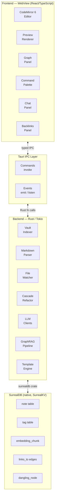
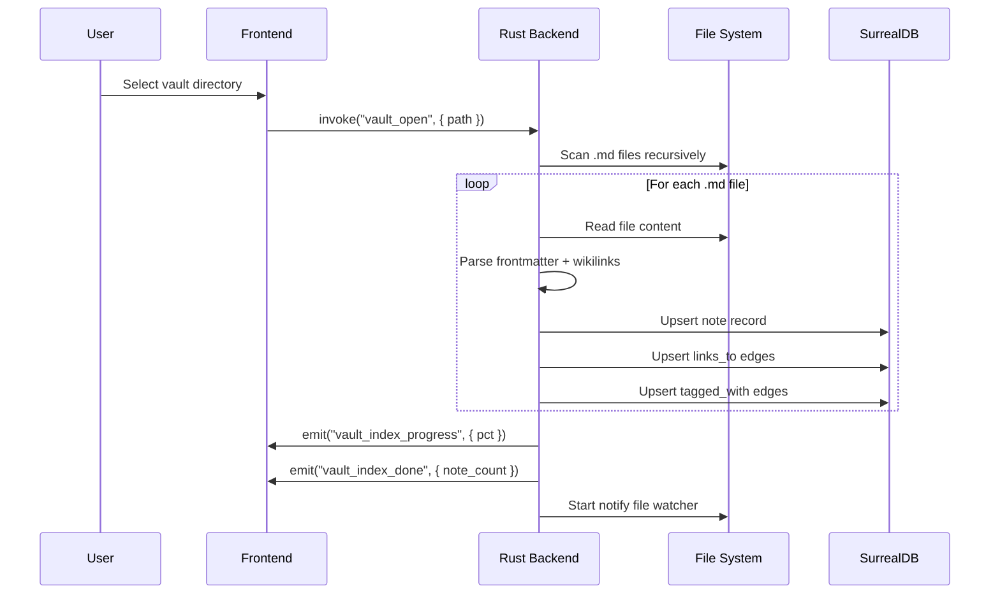
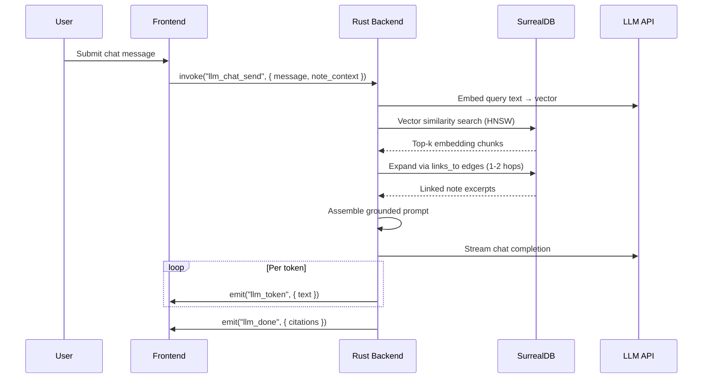
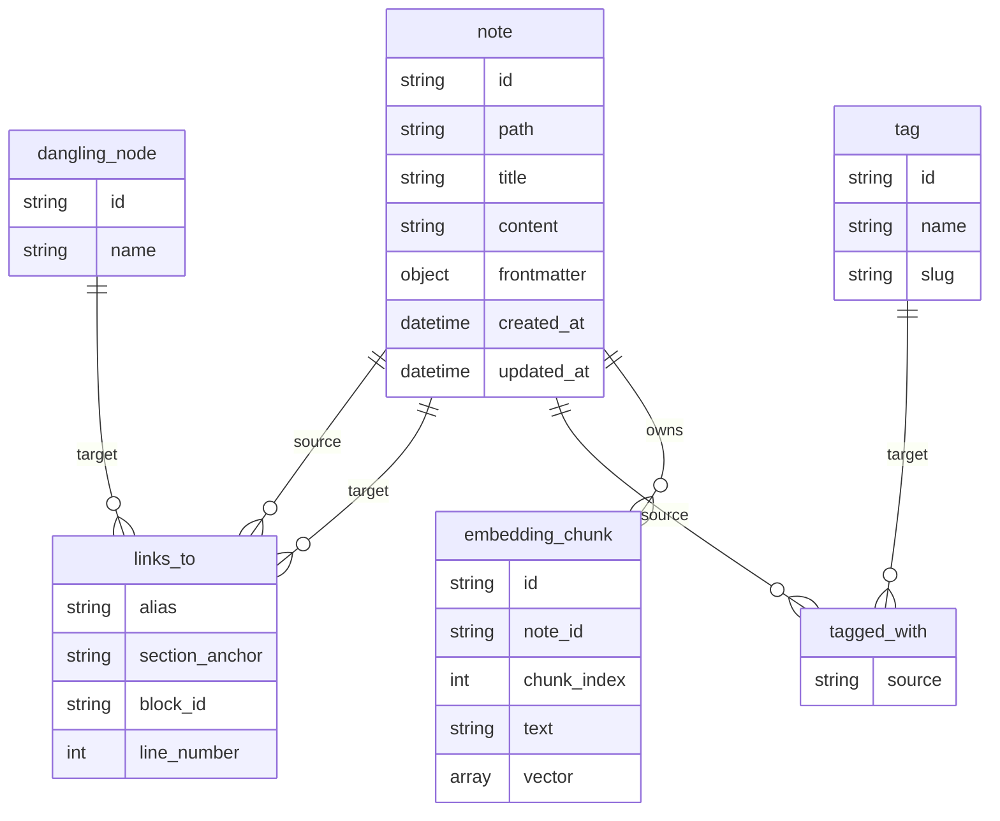

# GraphNotes — Architecture and Feature Design

**Version 2.0 | June 2026**
**Stack: Tauri 2.0 · Rust · React 18 / TypeScript · SurrealDB (native)**

---

## 1. High-Level Architecture

GraphNotes is a Tauri 2.0 hybrid application. Tauri acts as the seam between two entirely separate worlds: a **React/TypeScript frontend** rendered in the platform's native WebView, and a **Rust backend** running as the application process. The two halves communicate exclusively through Tauri's typed IPC layer.

```
┌─────────────────────────────────────────────────────────────┐
│               PRESENTATION LAYER (WebView)                  │
│  React 18 · TypeScript · Vite · CodeMirror 6 · KaTeX       │
│  D3.js / Sigma.js · Tailwind CSS · Radix UI / shadcn/ui     │
└──────────────────────┬──────────────────────────────────────┘
                       │  Tauri IPC  (invoke / emit)
┌──────────────────────▼──────────────────────────────────────┐
│                  IPC BRIDGE LAYER                           │
│   Tauri Commands (#[tauri::command]) + Tauri Events         │
│   @tauri-apps/api (TypeScript bindings)                     │
└──────────────────────┬──────────────────────────────────────┘
                       │  Rust function calls / Tokio tasks
┌──────────────────────▼──────────────────────────────────────┐
│               CORE ENGINE LAYER (Rust / Tokio)              │
│  Markdown Parser · Wikilink Engine · File Watcher           │
│  Template Engine · LLM Clients · GraphRAG Pipeline          │
└──────────────────────┬──────────────────────────────────────┘
                       │  surrealdb Rust crate
┌──────────────────────▼──────────────────────────────────────┐
│             PERSISTENCE LAYER (SurrealDB native)            │
│  SurrealKV storage engine · Graph edges · HNSW vector index │
│  Persisted to OS app-data directory                         │
└─────────────────────────────────────────────────────────────┘
```

---

## 2. Layer Details

### 2.1 Presentation Layer

The frontend is a standard React 18 single-page application built with Vite. In development, Vite's HMR gives near-instant UI iteration without any Rust recompilation. In production, Vite bundles the frontend into static assets that Tauri serves from the app binary.

**Key frontend responsibilities:**

| Concern | Solution |
|---|---|
| Text editing | CodeMirror 6 (React component wrapper via `@codemirror/view`) |
| Markdown rendering | Marked.js or remark/rehype pipeline in the preview pane |
| LaTeX math | KaTeX — `renderToString()` in the preview renderer |
| Syntax highlighting | CodeMirror 6 language packs (`@codemirror/lang-*`) |
| Graph visualization | D3.js force simulation (up to ~2k nodes) or Sigma.js + graphology (>2k nodes) |
| UI primitives | Radix UI or shadcn/ui (command palette, dialogs, popovers, panels) |
| Fuzzy search (client-side) | Fuse.js for Quick Switcher and command palette filtering |
| Theming | Tailwind CSS + CSS custom properties for light/dark token switching |
| State management | React Context + `useState`/`useReducer` for local; React Query for async Tauri commands |

**CodeMirror 6 integration note:** CodeMirror owns its own DOM subtree. Treat it as a controlled component: React holds the document source string as state, passes it to CodeMirror on mount, and listens to `EditorView.updateListener` to sync changes back. Never let both React state and CodeMirror's internal state try to re-render from the same edit — pick one source of truth per operation (CM for keystrokes, React for programmatic inserts like template injection).

---

### 2.2 IPC Bridge Layer

Tauri's IPC is the only communication path between JavaScript and Rust. There is no shared memory, no native Node.js module, and no WebSocket — just typed function calls.

**Commands (request/response):**
```rust
// Rust side — src-tauri/src/commands/vault.rs
#[tauri::command]
async fn vault_open(path: String, state: tauri::State<'_, AppState>) -> Result<VaultInfo, String> {
    // ...
}

// TypeScript side
import { invoke } from "@tauri-apps/api/core";
const info = await invoke<VaultInfo>("vault_open", { path: selectedPath });
```

**Events (streaming / push):**
```rust
// Rust pushes token stream during LLM inference
app_handle.emit("llm_token", TokenPayload { text: token }).unwrap();

// TypeScript listens
import { listen } from "@tauri-apps/api/event";
const unlisten = await listen<TokenPayload>("llm_token", (event) => {
  setResponse(prev => prev + event.payload.text);
});
```

**Command naming convention:** `domain_action` — e.g., `vault_open`, `vault_close`, `note_save`, `note_delete`, `graph_query_backlinks`, `graph_query_forward_links`, `llm_chat_send`, `llm_chat_cancel`, `tag_list`, `search_full_text`.

**Payload types:** All IPC payloads are Rust structs with `#[derive(Serialize, Deserialize)]`. Maintain matching TypeScript type definitions in `src/types/ipc.ts`. Consider using `ts-rs` or `specta` to auto-generate the TypeScript types from the Rust structs to prevent drift.

---

### 2.3 Core Engine Layer

The Rust backend is structured as a set of Tokio-async modules. The Tauri `AppState` struct (wrapped in `Arc<Mutex<...>>` or using Tokio's `RwLock`) holds shared handles: the SurrealDB connection, the vault watcher, and the LLM client pool.

```
src-tauri/src/
├── main.rs               # Tauri builder, command registration, state init
├── state.rs              # AppState struct: DB handle, vault path, watcher handle
├── commands/
│   ├── vault.rs          # vault_open, vault_close, vault_rebuild
│   ├── notes.rs          # note_read, note_save, note_rename, note_delete
│   ├── graph.rs          # graph_query_backlinks, graph_query_forward_links, graph_full
│   ├── search.rs         # search_full_text, search_semantic
│   ├── llm.rs            # llm_chat_send, llm_complete_inline
│   └── tags.rs           # tag_list, tag_filter_notes
├── engine/
│   ├── parser.rs         # Markdown + wikilink + frontmatter parser (pulldown-cmark)
│   ├── indexer.rs        # Vault scanning, incremental index updates
│   ├── watcher.rs        # notify file watcher → Tokio channel → indexer
│   ├── refactor.rs       # Cascade link rename logic
│   └── templates.rs      # Template variable substitution engine
├── db/
│   ├── mod.rs            # SurrealDB init, migrations
│   ├── notes.rs          # CRUD for note table
│   ├── graph.rs          # Edge creation, backlink queries
│   └── vectors.rs        # Embedding storage, HNSW similarity search
└── llm/
    ├── openai.rs         # async-openai client wrapper
    ├── ollama.rs         # ollama-rs client wrapper
    └── graphrag.rs       # Chunking, embedding, retrieval pipeline
```

**Concurrency model:**

All Tauri commands are `async fn` and run on Tokio's thread pool. For long-running operations (vault indexing, cascade refactoring), use `tokio::spawn` to move the work to a background task and stream progress back via Tauri events. This prevents any Tauri command from blocking.

```rust
#[tauri::command]
async fn vault_rebuild(app: tauri::AppHandle, state: tauri::State<'_, AppState>) -> Result<(), String> {
    let handle = app.clone();
    let db = state.db.clone();
    tokio::spawn(async move {
        // long-running rebuild...
        handle.emit("vault_rebuild_progress", ProgressPayload { pct: 42 }).ok();
        // ...
        handle.emit("vault_rebuild_done", ()).ok();
    });
    Ok(()) // returns immediately; progress comes via events
}
```

---

### 2.4 Persistence Layer

SurrealDB runs entirely in-process within the Rust backend. No external server process. The SurrealKV engine stores data in the OS application data directory.

**Initialization:**
```rust
use surrealdb::Surreal;
use surrealdb::engine::local::SurrealKv;

let db = Surreal::new::<SurrealKv>(app_data_path.join("graphnotes.db")).await?;
db.use_ns("graphnotes").use_db("vault").await?;
```

**Schema (SurrealQL):**
```sql
-- Notes are both documents and graph nodes
DEFINE TABLE note SCHEMAFULL;
DEFINE FIELD path       ON note TYPE string;
DEFINE FIELD title      ON note TYPE string;
DEFINE FIELD content    ON note TYPE string;
DEFINE FIELD frontmatter ON note TYPE object;
DEFINE FIELD created_at ON note TYPE datetime;
DEFINE FIELD updated_at ON note TYPE datetime;
DEFINE INDEX note_path  ON note COLUMNS path UNIQUE;

-- Graph edges
DEFINE TABLE links_to   SCHEMAFULL TYPE RELATION IN note OUT note | dangling_node;
DEFINE FIELD alias       ON links_to TYPE option<string>;
DEFINE FIELD section_anchor ON links_to TYPE option<string>;
DEFINE FIELD block_id   ON links_to TYPE option<string>;
DEFINE FIELD line_number ON links_to TYPE int;

-- Tags as taxonomy nodes
DEFINE TABLE tag SCHEMAFULL;
DEFINE FIELD name       ON tag TYPE string;
DEFINE FIELD slug       ON tag TYPE string;
DEFINE INDEX tag_slug   ON tag COLUMNS slug UNIQUE;

DEFINE TABLE tagged_with SCHEMAFULL TYPE RELATION IN note OUT tag;

-- Vector chunks for RAG
DEFINE TABLE embedding_chunk SCHEMAFULL;
DEFINE FIELD note_id    ON embedding_chunk TYPE record<note>;
DEFINE FIELD chunk_index ON embedding_chunk TYPE int;
DEFINE FIELD text       ON embedding_chunk TYPE string;
DEFINE FIELD vector     ON embedding_chunk TYPE array<float>;
DEFINE INDEX chunk_hnsw ON embedding_chunk FIELDS vector HNSW DIMENSION 1536;

-- Dangling link placeholders
DEFINE TABLE dangling_node SCHEMAFULL;
DEFINE FIELD name       ON dangling_node TYPE string;
DEFINE INDEX dangling_name ON dangling_node COLUMNS name UNIQUE;
```

---

## 3. Feature Architecture Details

### 3.1 Vault Indexer

The indexer is the heart of the engine. It runs once on vault open and then responds to file change events incrementally.

```
Vault open
   │
   ▼
Scan directory tree (tokio::fs::read_dir, recursive)
   │
   ├─► For each .md file: read content, parse frontmatter + wikilinks
   │                        → upsert note record in SurrealDB
   │                        → create/update links_to edges
   │                        → create/update tagged_with edges
   │
   ▼
Emit "vault_index_done" event to frontend
   │
   ▼
Start notify file watcher on vault root
   │
   ▼
On file change event:
   ├─ Modified → re-parse and upsert note + re-diff edges
   ├─ Created  → parse and insert note + create edges
   └─ Deleted  → remove note + remove outgoing edges (dangling check for incoming)
```

**Frontmatter parsing** uses a Rust regex or `serde_yaml` to extract the YAML block, then deserializes it into a `serde_json::Value` for flexible schema storage in SurrealDB.

**Wikilink parsing** uses a regex over the parsed Markdown AST output to extract `[[Target]]`, `[[Target|Alias]]`, `[[Target#Section]]`, and `[[Target#^block-id]]` patterns.

---

### 3.2 Linking Engine

Every wikilink creates or updates a `links_to` edge in SurrealDB. Resolution happens at query time, not index time, to keep the index fast.

**Backlinks query (SurrealQL):**
```sql
SELECT <-links_to<-note.* AS backlinks FROM note WHERE path = $path;
```

**Unlinked mentions query:** Full-text search for the note title across all note content, excluding paths that already have a `links_to` edge.

**Cascade refactoring on rename:**
```
User renames "Old Name.md" to "New Name.md"
   │
   ├─► Rust: update note record path and title in SurrealDB
   ├─► Tokio task: query all links_to edges pointing to old note
   │               for each source note:
   │               - read .md file from disk
   │               - regex-replace [[Old Name]] → [[New Name]]
   │               - write file back
   │               - emit progress event
   └─► Emit "refactor_done" with count of affected files
```

---

### 3.3 LLM and GraphRAG Pipeline

```
User submits chat message
   │
   ▼
GraphRAG retrieval (if enabled):
   ├─ Embed user query → embedding vector (via configured embedding model API)
   ├─ Vector similarity search: SELECT * FROM embedding_chunk WHERE vector <|10|> $query_vec
   ├─ For each top-k chunk: expand context by traversing links_to edges (1-2 hops)
   └─ Assemble context: [relevant_chunks] + [linked_note_excerpts]
   │
   ▼
Build LLM prompt:
   [System prompt] + [vault context] + [current note content] + [chat history] + [user message]
   │
   ▼
Stream LLM response via async-openai / ollama-rs
   │
   ▼
For each token: emit "llm_token" Tauri event → TypeScript appends to chat UI
   │
   ▼
On stream complete: emit "llm_done" with source citations
```

---

### 3.4 Graph Visualization Data Flow

The graph panel queries SurrealDB for the full edge list and node metadata, then hands it to D3.js or Sigma.js for rendering. Queries run on demand (panel open) and on vault change events.

```sql
-- Fetch all nodes and edges for graph render
SELECT id, title, count(<-links_to) + count(links_to->) AS degree FROM note;
SELECT in.id AS source, out.id AS target FROM links_to;
SELECT id, name FROM dangling_node;
```

The frontend maps these into D3's `{ nodes, links }` format. Node radius scales with `degree`. Dangling nodes render with a dashed stroke. Click handler calls `invoke("note_read", { path })` and opens the editor.

---

## 4. Platform-Specific Notes

### 4.1 Windows
- File watching: `notify` uses `ReadDirectoryChangesW`
- Credential storage (LLM API keys): Windows Credential Manager via `tauri-plugin-stronghold` or the `keyring` crate
- Build: `cargo tauri build --target x86_64-pc-windows-msvc` → produces NSIS `.exe` and optional MSI

### 4.2 Linux
- File watching: `notify` uses `inotify`
- Credential storage: Linux Secret Service (libsecret) via `keyring` crate
- WebView: WebKitGTK (ensure `libwebkit2gtk-4.1` is installed on the build host)
- Build: `cargo tauri build` → produces AppImage and `.deb`

### 4.3 Android (Tauri Mobile)
- Introduced in Tauri 2.0 (stable)
- Same Rust backend compiles to `aarch64-linux-android` target
- Same React frontend runs in Android's System WebView
- File system: uses Tauri's file plugin with Android-specific paths (`Context.getFilesDir()`)
- Vault selection: folder picker via `tauri-plugin-dialog` on Android
- Build: `cargo tauri android build` after running `cargo tauri android init`
- **Android-specific caution:** File watching via `notify` has limited Android support; poll-based fallback may be needed. Validate early.

---

## 5. Development Workflow

```
graphnotes/
├── src/                    # React frontend
│   ├── components/
│   │   ├── Editor.tsx      # CodeMirror 6 wrapper
│   │   ├── Preview.tsx     # Markdown + KaTeX renderer
│   │   ├── GraphPanel.tsx  # D3 / Sigma.js force graph
│   │   ├── BacklinksPanel.tsx
│   │   ├── CommandPalette.tsx
│   │   └── ChatPanel.tsx
│   ├── types/
│   │   └── ipc.ts          # IPC payload types (keep in sync with Rust structs)
│   ├── hooks/
│   │   ├── useVault.ts
│   │   ├── useNote.ts
│   │   └── useLLM.ts
│   └── App.tsx
├── src-tauri/
│   ├── Cargo.toml
│   ├── tauri.conf.json
│   └── src/
│       ├── main.rs
│       ├── state.rs
│       ├── commands/
│       ├── engine/
│       ├── db/
│       └── llm/
├── package.json
└── vite.config.ts
```

**Development commands:**
```bash
# Start with HMR (frontend hot-reload, Rust recompile on backend changes)
cargo tauri dev

# Build for current platform
cargo tauri build

# Android development (requires Android SDK + NDK)
cargo tauri android dev
cargo tauri android build
```

---

## 6. UML Diagrams (Mermaid)

### 6.1 System Component Diagram



### 6.2 Note Indexing Sequence



### 6.3 GraphRAG Query Sequence



### 6.4 SurrealDB Schema (Entity-Relationship)


